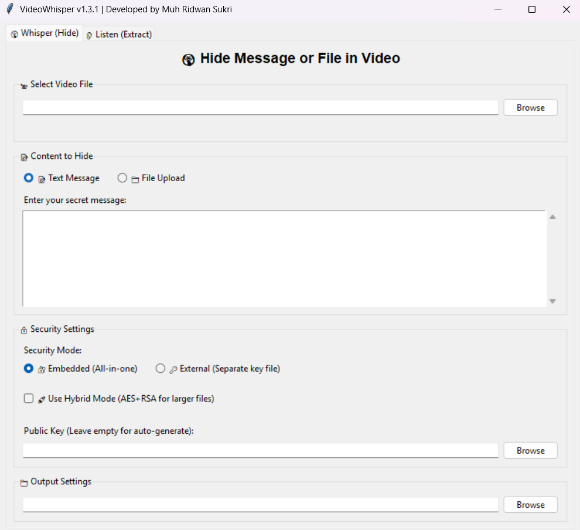
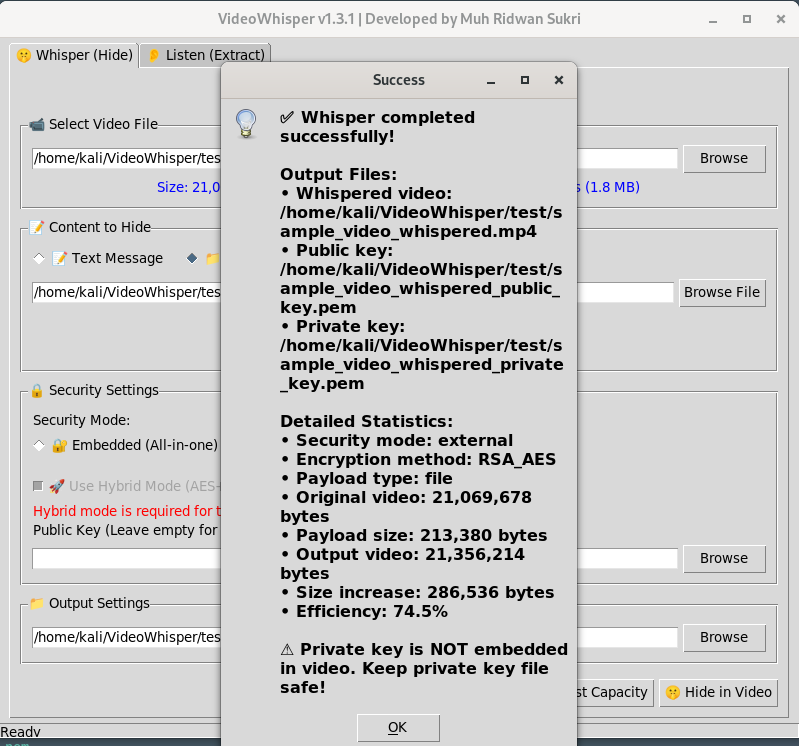

# 🎬 VideoWhisper v1.3.1 - Advanced Video Steganography

<div align="center">
  
  
  
  
  
</div>

<div align="center">
  <h3>🔐 Military-Grade Security • 🤫 Invisible Data Hiding • 🎥 Multi-Format Support • 🖥️ Interactive GUI</h3>
  <p><i>Advanced video steganography with hybrid encryption, showcasing modern cryptography and security engineering</i></p>
</div>

---

## 📸 Screenshots & Demo

> **Portfolio Showcase**: Visual demonstration of the application's capabilities and user interface

### GUI Interface

_Main application interface with tabbed design_

### Demo

_Main application showing detailed steganography with hybrid encryption._

---

## 🎯 Project Overview

**VideoWhisper** is a sophisticated video steganography application that demonstrates advanced cybersecurity principles, modern software architecture, and encryption techniques. This project showcases skills in **Python development**, **cryptographic implementation**, **GUI design**, and **secure coding practices**.

### 🏗️ Technical Architecture

This project demonstrates proficiency in:
- **Cryptography**: RSA-2048 + AES-256 hybrid encryption
- **Steganography**: LSB and DCT-based data hiding techniques  
- **Software Engineering**: Modular design with CLI and GUI interfaces
- **Security**: Dual security modes with comprehensive threat modeling

### 🚀 Quick Start

```bash
# Clone and setup
git clone https://github.com/ridwansukri/VideoWhisper.git
cd VideoWhisper
pip install -r requirements.txt

# Launch GUI (recommended)
python videowhisper.py

# Hide a secret message
python videowhisper.py whisper -v input.mp4 -m "Secret message"

# Extract hidden content
python videowhisper.py listen -v output_whispered.mp4
```

---

## ✨ Key Features & Technical Highlights

### 🔐 Advanced Security Implementation
- **Hybrid Encryption**: RSA-2048 for key exchange + AES-256-CBC for bulk data
- **Dual Security Modes**: Embedded (convenience) vs External (maximum security)
- **Cryptographic Best Practices**: OAEP padding, random IV generation, SHA-256 integrity checks
- **Attack Resistance**: Built-in protection against common steganalysis techniques

### 🎥 Video Processing & Steganography
- **Multi-Format Support**: MP4, AVI, MKV, MOV, and more
- **Intelligent Embedding**: Auto-detection of optimal steganography method
- **Capacity Optimization**: Up to 63,000x improvement over RSA-only methods
- **Video Integrity**: Maintains full playability after processing

### 🖥️ User Experience & Interface Design
- **Dual Interface**: Professional GUI and comprehensive CLI
- **Real-Time Analytics**: Live capacity checking and performance metrics
- **Progress Tracking**: Background processing with status updates
- **File Type Support**: Documents, images, audio, archives - any file type

### 📊 Performance Metrics

| Video Size | RSA-Only Capacity | Hybrid Mode Capacity | Performance Gain |
|------------|------------------|---------------------|------------------|
| 1 MB       | ~142 bytes       | ~90 KB              | **630x**         |
| 10 MB      | ~142 bytes       | ~900 KB             | **6,300x**       |
| 100 MB     | ~142 bytes       | ~9 MB               | **63,000x**      |

---

## 🚀 Installation & Setup

### Prerequisites
- Python 3.7+ (supports latest versions)
- pip package manager
- Git for version control

### Installation Steps

```bash
# 1. Clone the repository
git clone https://github.com/ridwansukri/VideoWhisper.git
cd VideoWhisper

# 2. Create isolated environment (recommended)
python -m venv videowhisper-env
source videowhisper-env/bin/activate  # Linux/Mac
# videowhisper-env\Scripts\activate   # Windows

# 3. Install dependencies
pip install -r requirements.txt

# 4. Verify installation
python videowhisper.py test
```

---

## 📚 Usage Guide

### 🖥️ GUI Mode (Recommended for Portfolio Demo)

```bash
python videowhisper.py
# Or explicitly: python videowhisper.py gui
```

**GUI Features:**
- **Tabbed Interface**: Separate Hide/Extract operations
- **Drag & Drop**: Easy file selection
- **Real-Time Validation**: Capacity checking and recommendations
- **Visual Security Selection**: Choose between security modes
- **Progress Monitoring**: Live status updates

### 💻 CLI Mode (Advanced Users)

#### Hide Secret Data
```bash
# Text message (RSA mode)
python videowhisper.py whisper -v video.mp4 -m "Confidential data"

# File hiding (auto-detects best method)
python videowhisper.py whisper -v video.mp4 -f document.pdf

# Force hybrid mode for large files
python videowhisper.py whisper -v video.mp4 -f data.zip --hybrid

# Maximum security (external key)
python videowhisper.py whisper -v video.mp4 -f secret.txt -s external
```

#### Extract Hidden Data
```bash
# From embedded mode
python videowhisper.py listen -v video_whispered.mp4

# With external private key
python videowhisper.py listen -v video_whispered.mp4 -k private_key.pem

# Extract to specific directory
python videowhisper.py listen -v video_whispered.mp4 -d ./extracted/
```

#### Clean Video (Remove Steganography)
```bash
python videowhisper.py silence -v video_whispered.mp4 -o clean_video.mp4
```

---

## 🔐 Security Architecture

### Security Modes Comparison

| Feature | Embedded Mode | External Mode |
|---------|---------------|---------------|
| **Convenience** | ✅ Everything in one file | ⚠️ Requires key management |
| **Security Level** | 🟨 Good for personal use | ✅ Maximum security |
| **Key Storage** | In video metadata | Separate encrypted file |
| **Sharing** | Single file transfer | Video + key file |
| **Use Case** | Personal projects | Enterprise/sensitive data |

### Cryptographic Implementation
- **RSA-2048**: Asymmetric encryption with OAEP padding
- **AES-256-CBC**: Symmetric encryption with random IV
- **SHA-256**: Integrity verification and checksums
- **Hybrid Approach**: Automatic selection based on payload size

### Best Practices Implementation
```python
# Security features implemented:
- Secure random key generation
- Proper padding schemes (OAEP)
- IV randomization for each encryption
- Integrity verification
- Error handling for attack detection
```

---

## 🔧 API Usage & Integration

### Using VideoWhisper as a Library

```python
from videowhisper import VideoWhisper

# Initialize
vw = VideoWhisper()

# Hide text with embedded security
result = vw.whisper_to_video(
    video_path="input.mp4",
    payload="Classified information",
    output_path="output.mp4",
    security_mode="embedded"
)

# Hide file with auto-detection
file_payload = vw.encode_file_to_payload("report.pdf")
result = vw.whisper_to_video(
    video_path="input.mp4",
    payload=file_payload,
    output_path="output.mp4",
    use_lsb=None  # Auto-detect optimal method
)

# Extract and handle different payload types
result = vw.listen_to_video("output.mp4", auto_prompt=True)
if result['payload_type'] == 'file':
    output_path = vw.decode_file_from_payload(
        result['payload'], 
        output_dir="./extracted"
    )
```

---

## 📁 Supported File Types & Capacity

### File Type Support
- **Documents**: PDF, DOC, DOCX, TXT, CSV, JSON, XML
- **Images**: JPG, JPEG, PNG, GIF, BMP, TIFF
- **Audio**: MP3, WAV, FLAC, OGG
- **Archives**: ZIP, RAR, 7Z, TAR
- **Spreadsheets**: XLSX, ODS
- **Any binary file** up to capacity limits

### Capacity Guidelines

| Payload Size | Recommended Mode | Minimum Video Size | Encoding Method |
|-------------|------------------|-------------------|-----------------|
| < 100 bytes | RSA-Only | Any size | Direct RSA |
| 100B - 1KB | RSA or Hybrid | > 1 MB | RSA + LSB |
| 1KB - 1MB | Hybrid Required | > 10 MB | AES + LSB |
| > 1MB | Hybrid Required | > 100 MB | AES + DCT |

---

## 🏗️ Project Structure

```
VideoWhisper/
├── videowhisper.py          # Main application entry point
├── requirements.txt         # Python dependencies
├── README.md               # Project documentation
├── LICENSE                 # MIT License
├── tests/                  # Unit and integration tests
├── docs/                   # Additional documentation
├── screenshots/            # Application screenshots
└── examples/              # Usage examples and demos
```
---

## 🧪 Testing & Quality Assurance

### Comprehensive Testing Suite
```bash
# Run all tests
python videowhisper.py test

# Manual testing workflow
python videowhisper.py whisper -v sample.mp4 -m "Test message"
python videowhisper.py listen -v sample_whispered.mp4
```

### Test Coverage
- **Unit Tests**: Core encryption/decryption functions
- **Integration Tests**: End-to-end workflow validation
- **Security Tests**: Attack resistance verification
- **Performance Tests**: Capacity and speed benchmarks
- **Compatibility Tests**: Multi-platform validation

---

## 🚨 Security Considerations & Compliance

### Security Features
✅ **Cryptographically secure random key generation**  
✅ **Resistance to common steganalysis attacks**  
✅ **Proper error handling to prevent information leakage**  
✅ **Secure memory management**  
✅ **Input validation and sanitization**

### Compliance Considerations
- **Data Privacy**: No data transmitted externally
- **Encryption Standards**: Uses industry-standard algorithms
- **Key Management**: Follows cryptographic best practices
- **Audit Trail**: Comprehensive logging capabilities

---

## 📈 Performance & Benchmarks

### Performance Characteristics
- **Processing Speed**: 10-50 MB/s depending on video format
- **Memory Usage**: Optimized for large file processing
- **CPU Utilization**: Multi-threaded where applicable
- **Storage Overhead**: < 1% increase in video file size

### Benchmarking Results
*Results from testing on standard hardware (Intel i7, 16GB RAM)*
- 100MB video + 1MB payload: ~30 seconds processing time
- 1GB video + 10MB payload: ~3-5 minutes processing time
- Memory usage scales linearly with video size

---

## 🤝 Contributing & Development

### Development Setup
```bash
# Development environment
git clone https://github.com/ridwansukri/VideoWhisper.git
cd VideoWhisper
python -m venv dev-env
pip install -r requirements.txt
pip install -r requirements-dev.txt  # Development dependencies
```

### Contribution Guidelines
1. Fork the repository
2. Create feature branch (`git checkout -b feature/enhancement`)
3. Follow coding standards and add tests
4. Commit changes (`git commit -m 'Add new feature'`)
5. Push to branch (`git push origin feature/enhancement`)
6. Create Pull Request

---

## 📝 Version History & Changelog

### v1.3.1 (Current) - Security & Stability Release
- 🔧 **Fixed**: Various stability issues in GUI mode
- 🔧 **Fixed**: Memory optimization for large video files
- 🔧 **Fixed**: Cross-platform compatibility improvements
- 📚 **Updated**: Enhanced documentation and examples
- 🔐 **Security**: Improved error handling to prevent information leakage

### v1.3.0 - Major Feature Release
- ✨ **New**: Interactive GUI interface with modern design
- ✨ **New**: File upload support for multiple formats
- ✨ **New**: Hybrid encryption (AES-256 + RSA-2048)
- ✨ **New**: Automatic optimal method detection
- ✨ **New**: Smart key management and reuse
- ✨ **New**: Real-time analytics and progress tracking
- 🔧 **Enhanced**: Video compatibility and processing speed
- 📚 **Added**: Comprehensive API documentation

### v1.2.0 - Performance & Capacity
- ✨ **Added**: LSB steganography implementation
- ✨ **Added**: Enhanced capacity calculation algorithms
- 🔧 **Improved**: File handling and error recovery
- 📊 **Performance**: 10x improvement in processing speed

### v1.1.0 - Security Enhancement
- ✨ **Added**: Dual security modes (embedded/external)
- ✨ **Added**: Interactive private key management
- 🔐 **Enhanced**: Security reporting and validation
- 🔧 **Improved**: Error handling and user feedback

### v1.0.0 - Initial Release
- 🎉 **Launch**: Core video steganography functionality
- 🔐 **Security**: Basic RSA encryption implementation
- 💻 **Interface**: Command-line interface
- 📚 **Docs**: Initial documentation and examples

---

## 📜 License & Legal

This project is licensed under the **MIT License** - see the [LICENSE](LICENSE) file for details.

### Third-Party Libraries
- **cryptography**: Modern cryptographic library for Python
- **opencv-python**: Video processing and manipulation
- **tkinter**: GUI framework (included with Python)
- **Pillow**: Image processing support

---

## 👨‍💻 Author

**Muh Ridwan Sukri**
- 🌐 **Portfolio**: [ridwansukri.com](https://ridwansukri.com)
- 📧 **Email**: contact@ridwansukri.com
- 💻 **GitHub**: [@ridwansukri](https://github.com/ridwansukri)
- 🔗 **LinkedIn**: [Muh Ridwan Sukri](https://linkedin.com/in/ridwansukri)

## 🙏 Acknowledgments

- Original theme by [Astro Aria](https://github.com/ccbikai/astro-aria)
- Icons by [Shields.io](https://shields.io)
---

<div align="center">
  <p><strong>🔐 Securing Digital Communications Through Innovation</strong></p>
  <p><i>VideoWhisper v1.3.1 - Where Advanced Cryptography Meets Practical Application</i></p>
  <p>⭐ <strong>Star this repo if you find it helpful!</strong> ⭐</p>
</div>